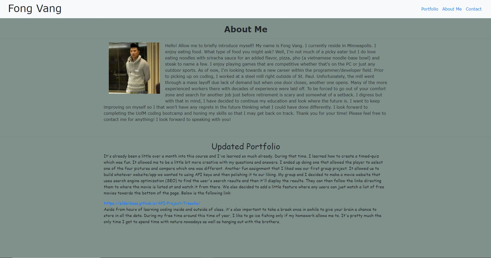
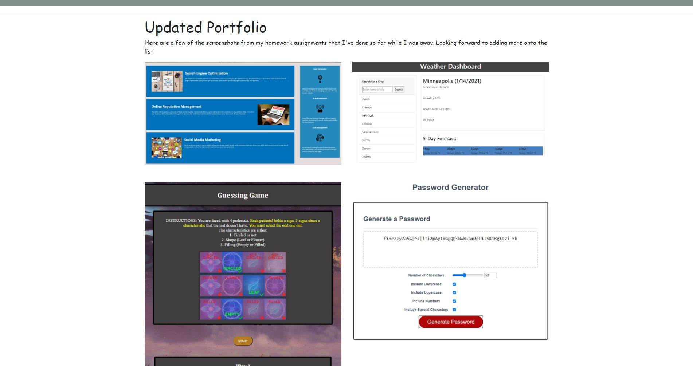
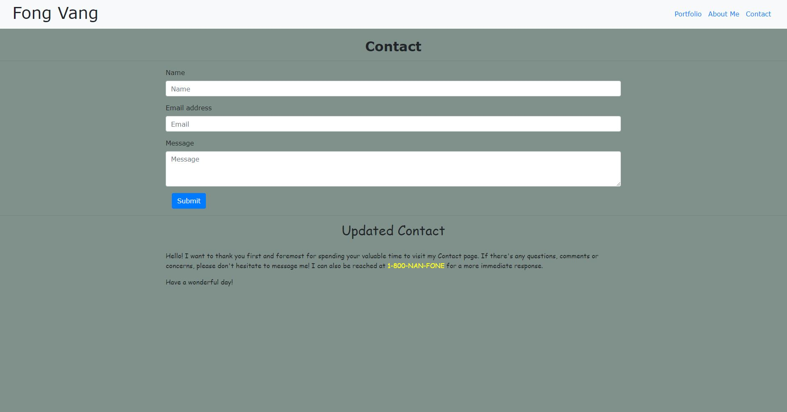

# Portfolio 

My portfolio contains random pictures of me as well as a quick bio about myself. The most updated portfolio provides even more pictures and also a paragraph about what I've been doing. There is a contacts page, a portfolio page which mainly has images and lastly an 'about me' page. Inside the deployed link on the portfolio page, there'll be my LinkedIn URL along with a link to my resume via Indeed.

## Purpose of a portfolio

The purpose of a portfolio is to show future employers whatever I want them to see but mainly to see how functional the webpage is and how capable you are. It also briefly tells the employer more about who you are as an individual, what you did, what your goals are, and what skills you can offer to them.
The page is also responsive too now so it's mobile-user friendly for anyone on-the-go.

## Screenshot

## Links

Deployed: https://fongvang09.github.io/Portfolio-HW/

GitHub: https://github.com/fongvang09/Portfolio-HW
